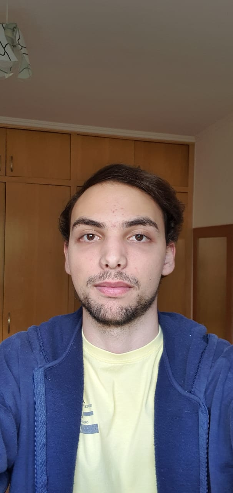
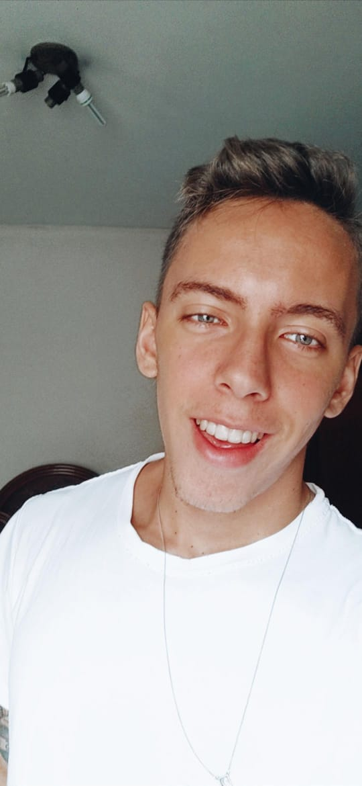
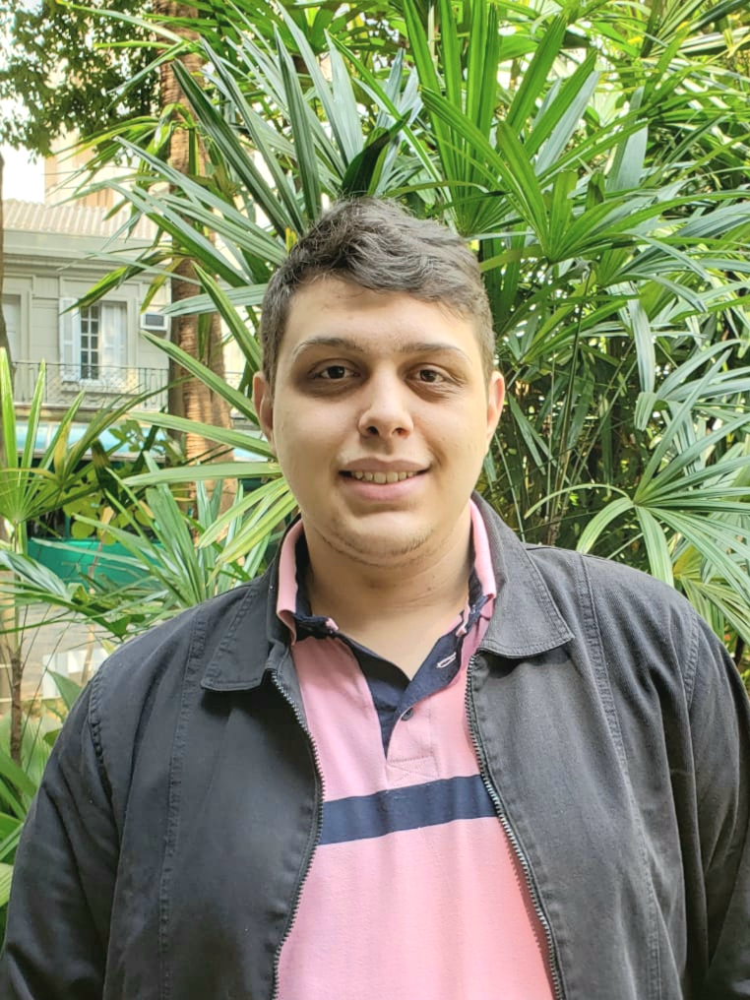

# Higgs Project

### What is this?
---

This is a game developed by a group of students at ESPM for their conclusion assignment, it is part of a bigger plan which involves a studio that bases its creations on the creative use of artificial intelligence 

### Purpose
---

Study popular artificial intelligence algorithms inside game development

## Sections

#### Programming: 
---
  The programming team was responsible for implementing all the mechanics inside the Unity Engine, along with studying and developing the insertion of artificial intelligence on these mechanics
###### Team
  - Cesar Moura Leite Westphal
  - Allan Urique

#### Game Design
---
  Responsible for creating game mechanics and structure the player's experience. Their work includes arranging camera positions, gameplay loop, player reward system, core mechanics and game objectives. 
##### Team
  - Allan Urique 
  - Cesar Moura Leite Westphal
  - Guilherme Priosti

#### Marketing
---
  Focused on market research, organizing and participating in game-related events, competition analysis and pricing. 
##### Team
 - Roberto Trocoli
 - Guilherme Priosti
 - Fernando Guimarães.

#### Storytelling
---
  In charge of creating the game's narrative. Their work goes from working with character and dialogue creation to the story's timeline 
##### Team
 - Guilherme Priosti 
 - Fernando Guimarães
 - Allan Urique.

#### Design
---
 Managing the conceptualization and creaton of visual assets for the game. Includes character modelling, environment creation and concept art for the game.
##### Team
 - Allan Urique
 - Fernando Guimarães
#### Sound Design
---
 This area creates soundtracks, sound effects and the recording of dialogue.
##### Team
 - Cesar Moura Leite Westphal 
 - Guilherme Priosti.
  
  ### Contributors
---

Cesar Moura Leite Westphal
<small>(
[github](https://github.com/Cesar-mlw) |
[linkedin](https://www.linkedin.com/in/cesar-moura-leite-westphal-222b57138/) |
[email](mailto:cesarmlwestphal@gmail.com)
)</small>

Allan Urique
<small>(
[artstation](https://www.artstation.com/allanurique) |
[linkedin](https://www.linkedin.com/in/allan-urique-b3a039190/) |
[email](mailto:allanurique951@gmail.com)
)</small>

Roberto Trocoli
<small>(
[twitter](https://twitter.com/RobertoTrocoli) |
[linkedin](https://www.linkedin.com/in/trocoli/) |
[email](mailto:roberto.trocolineto@gmail.com)
)</small>

Fernando Guimarães
<small>(
[linkedin](https://www.linkedin.com/in/fernando-guimar%C3%A3es-621473172?originalSubdomain=br) |
[email](mailto:fernandoguima10@hotmail.com)
)</small>

Guilherme Priosti
<small>(
[email](mailto:guilhermepriosti@gmail.com)
)</small>

### Versions
---
The first three stages of our alpha build were assembled during 2020's first semester. We registered the evolution of the project through it's differente stages. Three alpha versions were produced, the following pictures showing the evolution between them.

#### Version 1 - Map Generation

#### Version 2 - Map Generation

#### Version 3 - Map Generation

#### Version 4 - Map Generation

#### Version 1 - Visual Effects

#### Version 2 - Visual Effects

#### Version 3 - Visual Effects

### License
---

MIT License

Copyright (c) 2019 ESPM Tech - PGT 2020 Group

Permission is hereby granted, free of charge, to any person obtaining a copy
of this software and associated documentation files (the "Software"), to deal
in the Software without restriction, including without limitation the rights
to use, copy, modify, merge, publish, distribute, sublicense, and/or sell
copies of the Software, and to permit persons to whom the Software is
furnished to do so, subject to the following conditions:

The above copyright notice and this permission notice shall be included in all
copies or substantial portions of the Software.

THE SOFTWARE IS PROVIDED "AS IS", WITHOUT WARRANTY OF ANY KIND, EXPRESS OR
IMPLIED, INCLUDING BUT NOT LIMITED TO THE WARRANTIES OF MERCHANTABILITY,
FITNESS FOR A PARTICULAR PURPOSE AND NONINFRINGEMENT. IN NO EVENT SHALL THE
AUTHORS OR COPYRIGHT HOLDERS BE LIABLE FOR ANY CLAIM, DAMAGES OR OTHER
LIABILITY, WHETHER IN AN ACTION OF CONTRACT, TORT OR OTHERWISE, ARISING FROM,
OUT OF OR IN CONNECTION WITH THE SOFTWARE OR THE USE OR OTHER DEALINGS IN THE
SOFTWARE.

### References
---

### Agradecimentos
---

